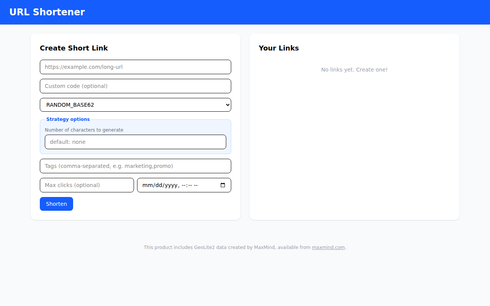
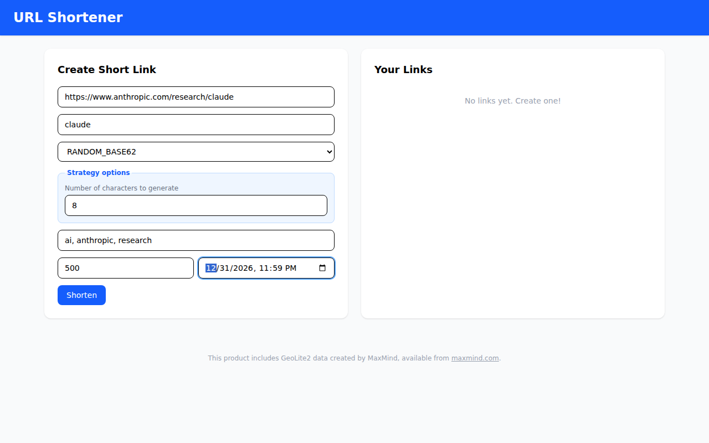
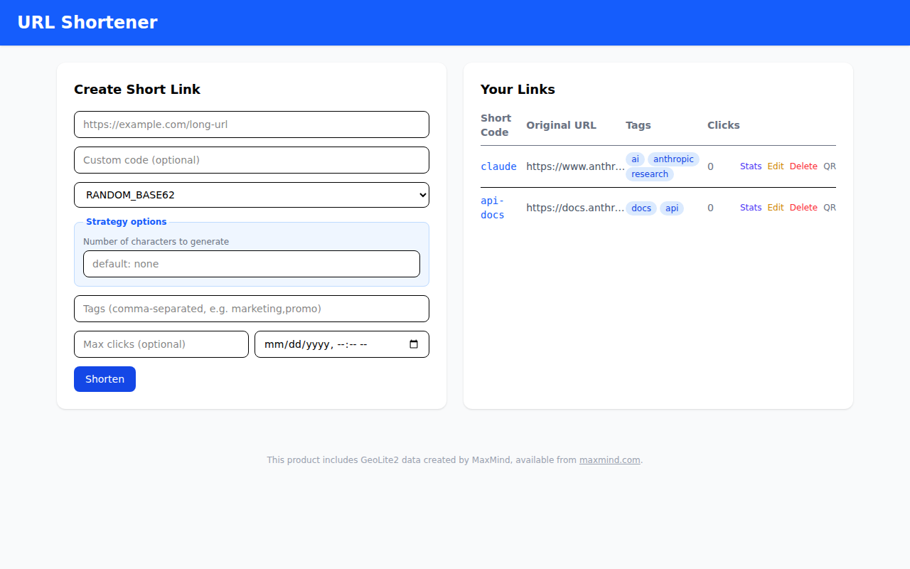
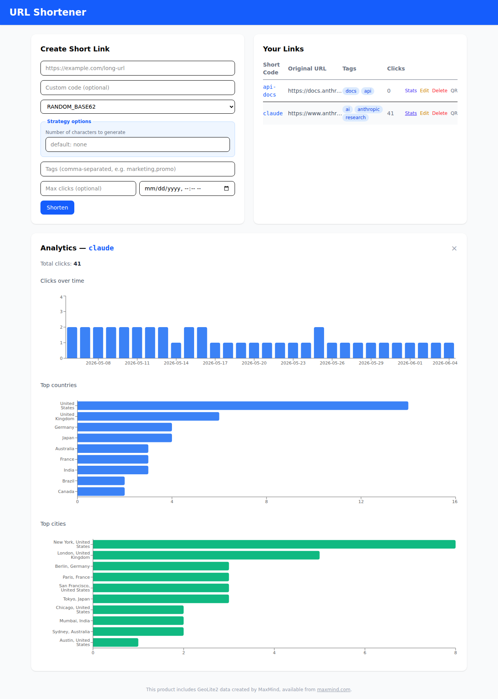
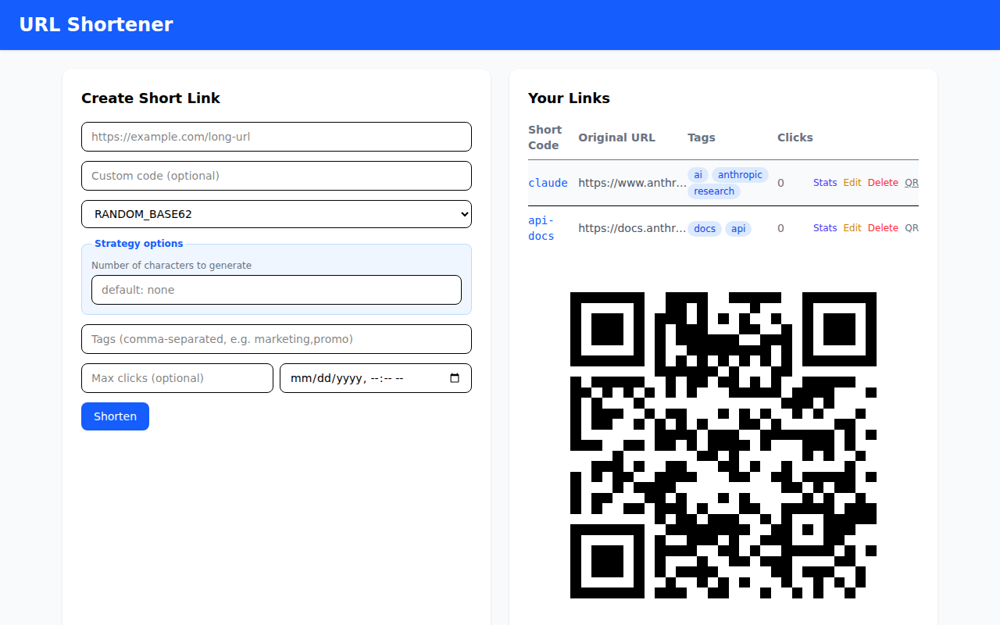
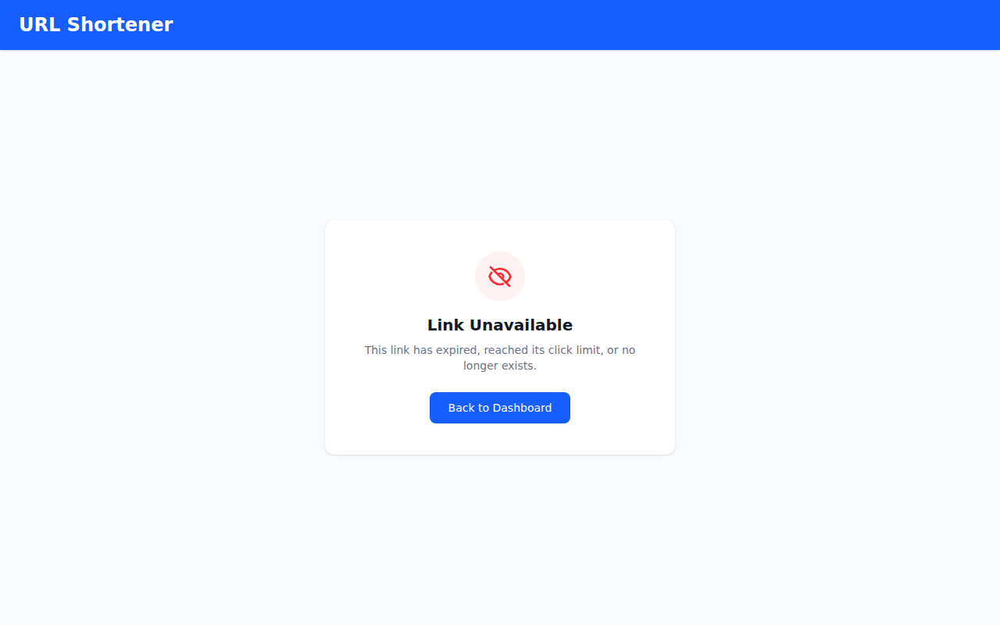
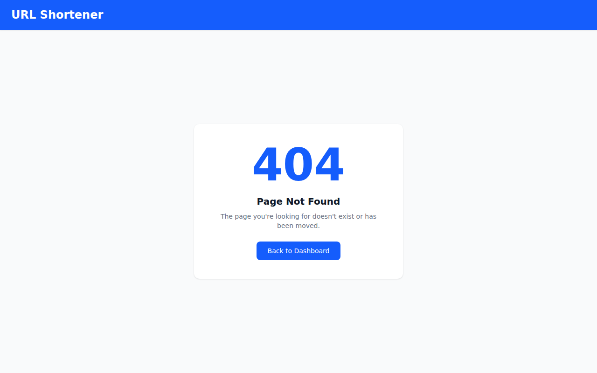

# User Guide

## Overview

URL Shortener is a single-page app that turns long URLs into short, trackable links. The dashboard is split into two panels: **Create Short Link** on the left and **Your Links** on the right.

---

## 1. The Dashboard

When you first open the app, the right panel shows "No links yet. Create one!" The left panel is always visible and ready for input. There is no login — all links are global to the instance.

---

## 2. Creating a Short Link

Fill in any combination of fields and click **Shorten**:

| Field | Required | Description |
|---|---|---|
| URL | Yes | The destination URL (must start with `https://` or `http://`) |
| Custom code | No | Your preferred short code (e.g. `claude`). If left blank, one is auto-generated using the selected strategy. |
| Strategy | No | How the auto-generated code is created: `RANDOM_BASE62` (default), `HASH_TRUNCATE`, or `SEQUENTIAL` |
| Number of characters to generate | No | Overrides the default code length for the selected strategy |
| Tags | No | Comma-separated labels (e.g. `ai, anthropic, research`). Tags appear as clickable pills in the table and can be used to filter links. |
| Max clicks | No | After this many clicks the link is disabled. Leave blank for unlimited. |
| Expires at | No | Date and time after which the link stops working. Leave blank to never expire. |

After clicking **Shorten**, the new link immediately appears in the **Your Links** table on the right.

---

## 3. The Links Table

Each row shows:

- **Short Code** — a clickable link you can share (e.g. `https://your-domain.com/claude`). Clicking it opens the destination in a new tab.
- **Original URL** — the long URL, truncated. Hover to see the full address.
- **Tags** — each tag is a pill button. Clicking a tag filters the table to show only links with that tag. A "Clear filter" badge appears at the top-right of the panel when a filter is active.
- **Clicks** — the total number of times the short link has been followed.
- **Actions** — four text buttons on the right of each row:
  - **Stats** — opens the analytics panel for that link (see below)
  - **Edit** — opens the create form pre-filled with the link's current values so you can update them
  - **Delete** — permanently removes the link after confirmation
  - **QR** — shows the QR code for the short link (see below)

---

## 4. Analytics Panel

Click **Stats** on any row to open the analytics panel. It appears below the links table and contains three sections:

- **Total clicks** — the cumulative click count for the link.
- **Clicks over time** — a bar chart showing daily click volume across the last 30 days.
- **Top countries** — a horizontal bar chart ranking clicks by country (requires the server to be configured with a MaxMind GeoLite2 database).
- **Top cities** — a horizontal bar chart ranking clicks by city within their country.

Clicking **Stats** on a different row switches the panel to that link's data. Click × to close the panel.

---

## 5. QR Code

Click **QR** on any row to display the QR code for that short link. The code appears inline below the table. It encodes the full short URL so anyone can scan it with a phone camera to be redirected.

A **Copy SVG** button is also available to copy the QR code as an SVG string, useful for embedding in documents or presentations.

Click **QR** again on the same row to hide the code.

---

## 6. Link Unavailable Page

If someone follows a short link that has expired (past its expiry date or past its click limit), they are redirected to `/link-expired`. The page displays a **Link Unavailable** message with a **Back to Dashboard** button to return to the main app.

---

## 7. Page Not Found

Any URL that doesn't match a known short code or app route renders a **404 — Page Not Found** page. A **Back to Dashboard** button returns the user to the main app.
